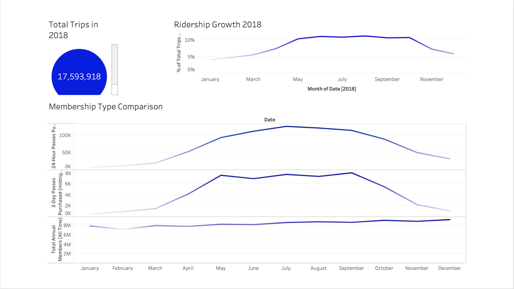
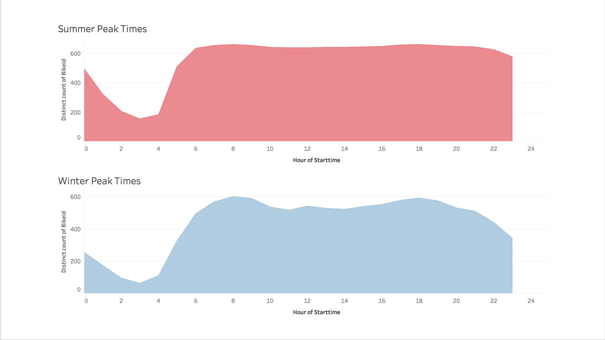
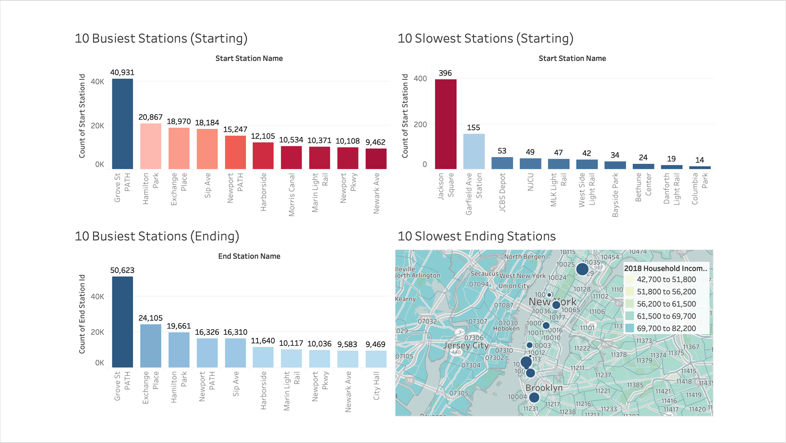
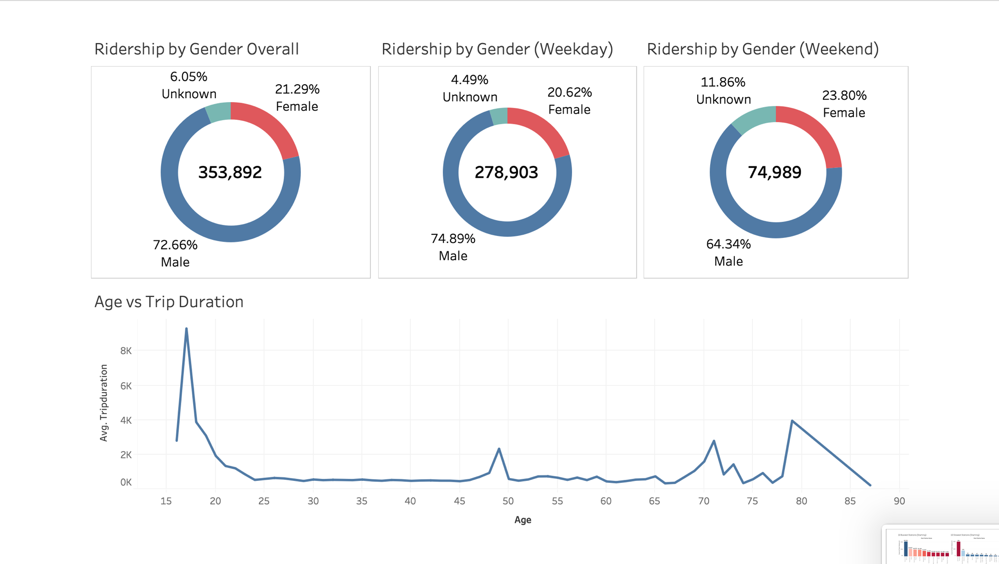
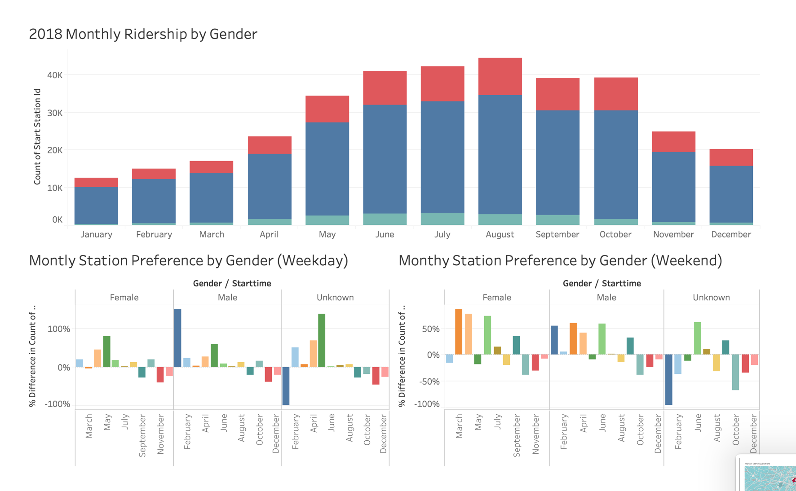
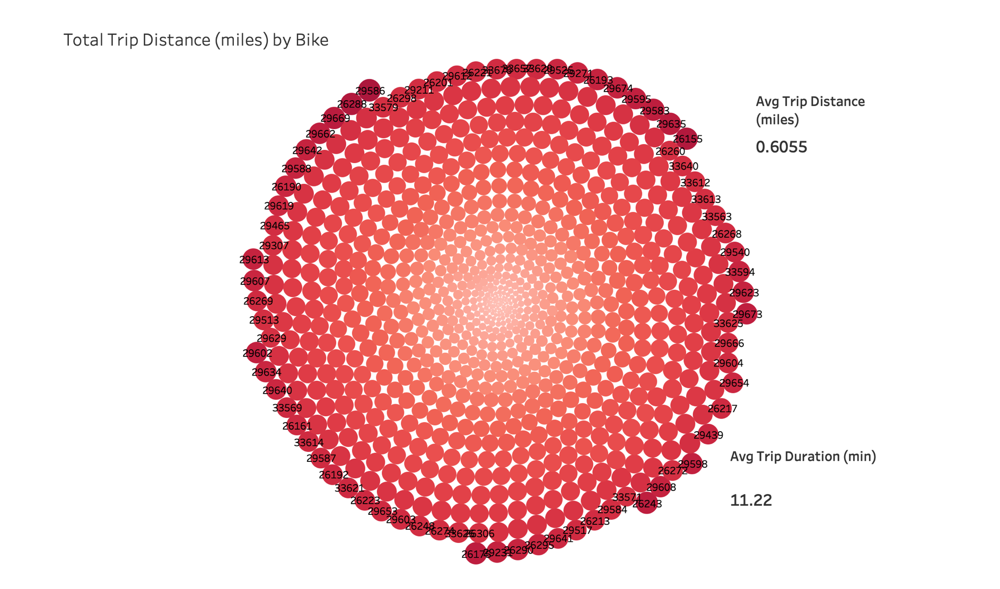
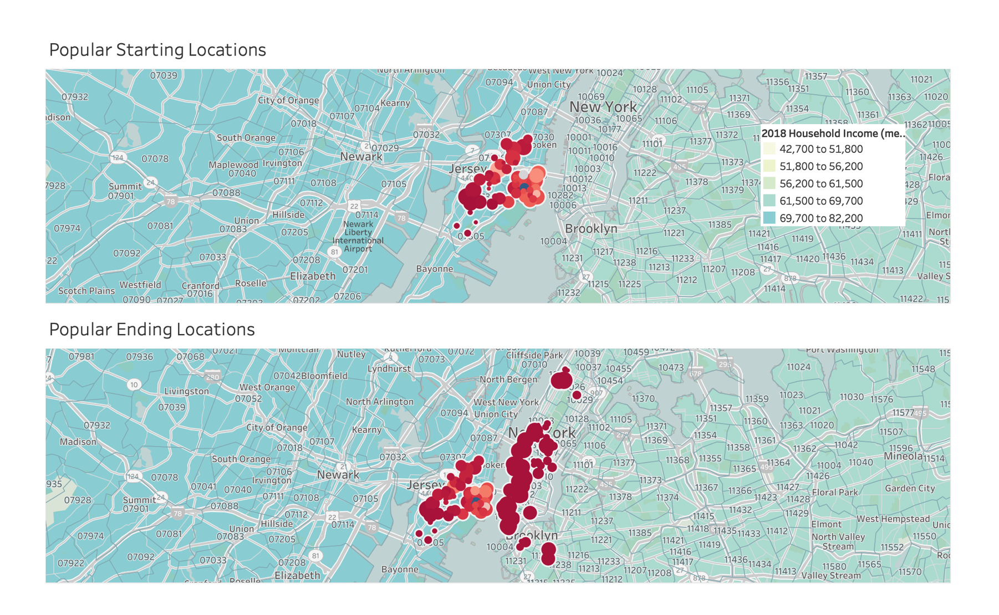

# Tableau - Citi Bike Analytics

Since 2013, the Citi Bike Program has implemented a robust infrastructure for collecting data on the program's utilization. Through the team's efforts, each month bike data is collected, organized, and made public on the [Citi Bike Data](https://www.citibikenyc.com/system-data) webpage.  Citi Bike boasts the largest bike sharing program in the United States

## Project Purpose

**To aggregate the data found in the Citi Bike Trip History Logs to build a data dashboard, story, or report.  Using any preferred timespan and merging multiple datasets from different periods, the following questions were addressed.**

* How many trips have been recorded total during the chosen period?

* By what percentage has total ridership grown? 

* How has the proportion of short-term customers and annual subscribers changed?

* What are the peak hours in which bikes are used during summer months? 

* What are the peak hours in which bikes are used during winter months?

* What are the top 10 stations in the city for starting a journey?

* What are the top 10 stations in the city for ending a journey?

* What are the bottom 10 stations in the city for starting a journey?

* What are the bottom 10 stations in the city for ending a journey?

* What is the gender breakdown of active participants (Male v. Female)?

* How effective has gender outreach been in increasing female ridership over the timespan?

* How does the average trip duration change by age?

* What is the average distance in miles that a bike is ridden?

* Which bikes (by ID) are most likely due for repair or inspection in the timespan?

* How variable is the utilization by bike ID?

* A static map that plots all bike stations with a visual indication of the most popular locations to start and end a journey with zip code data overlaid on top.